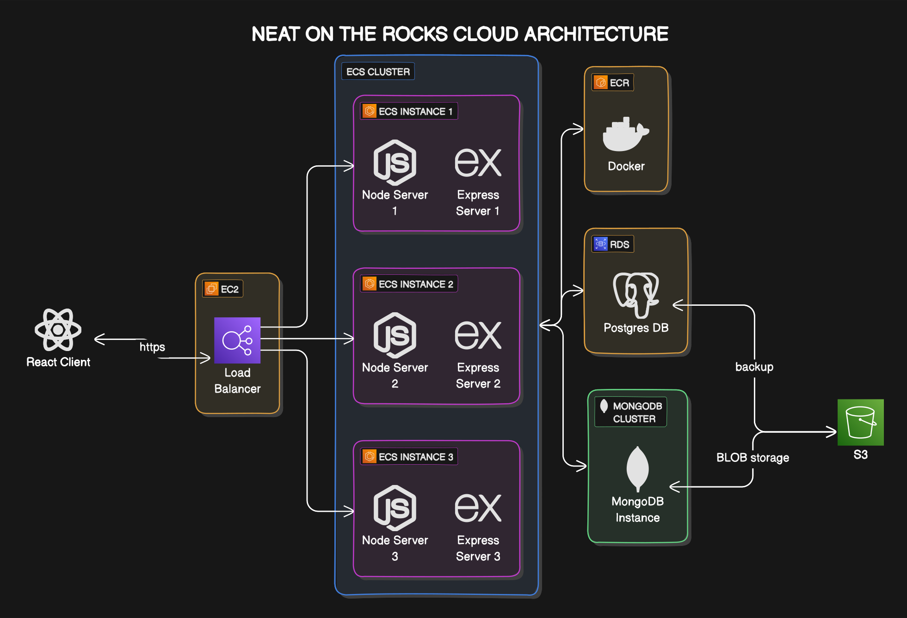

# NEAT ON THE ROCKS

## Introduction

Welcome to "Neat on the Rocks", a testament to my passion and evolving skills over several years. As a Chemistry student and multi-sport athlete in college, I was constantly seeking ways to enhance my performance and health. This led me to track my macronutrients, but I quickly realized the lack of information on the nutritional content of alcohol.

Undeterred, I embarked on a journey to fill this knowledge gap. I conducted tests on various spirits using analytical chemistry techniques and mathematical calculations to determine their macronutrient content. I compiled my findings in an Excel sheet, creating formulas to calculate the macronutrient content of different cocktails. This data was then integrated into my fitness tracker, enabling me to monitor my daily intake.

Recognizing the potential benefits of this tool, I decided to transform my data into an app after college. However, I faced a significant hurdle - I didn't know how to code. Starting with the basics of HTML and CSS, I created my first static webpage. As I gained confidence, I ventured into JavaScript, building mini projects to hone my skills.

My vision was to create a full-stack application with a social media component. This led me to migrate my code to React, and eventually, TypeScript with React. I developed a Node and Express API, connecting it using Axios, and implemented a MongoDB database, interacting with it via Mongoose from my Express app. Initially, I deployed my app on Render, but my curiosity about cloud computing led me to migrate to AWS, where I delved into cloud architecture.

This project encapsulates years of relentless work and learning. Through this journey, I've acquired skills in **React, Node, Express, MongoDB, PostgresQL, System Design, Docker, AWS, Moblile Development and Cloud Computing**. I hope you find *Neat on the Rocks* enjoyable and useful. I welcome feedback and suggestions for improvement, so please don't hesitate to reach out.

This is our orginization page. Though our main code is private, we have made the repositiores for the first couple ideas public.

## Features

- **Macro Nutrient Calculator**: Users are able to calculate the macronutrient content of various spirits and cocktails.
- **Perfect Cocktail Dilution Calculator**: Users can determine the optimal dilution ratio for their cocktails dependent on ingredients and mixing method.
- **BAC Estimator**: Registered Users can estimate their Blood Alcohol Content based on their body metrics and alcohol consumption.
- **Cocktail Recipes**: Users can access a database of cocktail recipes **without ads or scrolling infinitely** and filter them based on ingredients and spirit type. Soon will implement taste based off cocktail balance history.
- **Social Media Component**: Users can share their favorite cocktails and recipes with the community.(WIP)
- **My Fridge**: Users can input the ingredients they have in their fridge and receive cocktail recipes based on those ingredients.(WIP)
- **Check In**: Users can check in at bars and restaurants to share their location with friends.(WIP: with Native/PWA adaptation)
- **Zebra Scanner**: Users can scan the barcode of a beer/wine bottle to retrieve its ethanol content. (WIP: Will implement a database of beer and wine macronutrient content at the moment you can add it to your consumed drinks using the ounces and ABV)

## Cloud Architecture

## Entity Relationship Diagram

## Technologies Used

- **Frontend**: React, TypeScript, Axios, Styled Components, React-Router, React-Toastify, React-Native,  Zxing
- **Backend**: Node, Express, MongoDB, PostgreSQL Mongoose, JWT, Bcrypt, Cloudinary, Nodemon, Dotenv, Cors, Java, Javascript
- **DevOps**: GitHub Actions, Docker, Docker-Compose, Nginx, PM2, ECS, AWS, EC2, RDS, S3, Route 53, CloudFront, Vercel

## Future Implementations with Investments

- **ABBYY**: Implement [ABBYY](https://www.abbyy.com/) OCR to scan the label of a bottle and retrieve its information from our database.
